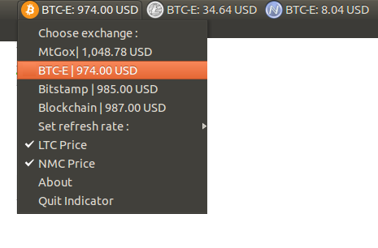

CryptoCoin-Price-Indicator
==========
by 
### jj9 

generalizes and combines old btc version originally written in jj9 repo and enhanced by RichHorrocks and Zapsoda (btcapicalls/setupfile maintainance for old btc version)  and ltc version in other jj9 repo

if you feel the need to share some bitcoin thanks or love
do so here. If you use this please credit it 

send any donation tips to 

BTC : 1ECXwPU9umqtsBAQesBW9981mx6sipPmyL

LTC : LUJz8yaS4uL1zrzwARbA4CiMpAwbpUwWY6

NMC : N1SKXkrcyhxVYwQGsbLTFMbGAgeqL2g9tZ

How to setup
------
1) Download the archive and extract it to a directory of your choice.

This can be done by downloading using the download zip link on this page or the following in terminal
	
	wget https://github.com/jj9btcproj/CryptoCoin-Price-Indicator/archive/master.zip

2) open the terminal navigate to the extracted folder

3) run 

	sudo sh installDependencies.sh

4) run 

	python setup.py

5) If you navigated to the extracted folder you can use the default path when asked for the path to the extracted files

6) If you want the indicatator to run on startup type Y and press enter when asked "Run on startup? (Y/N): "

7) Troubleshooting: If you run into a problem with ownership on desktop file cryptocoin-price-indicator.desktop (a lock in the icon for the desktop file)

	sudo chown $USER cryptocoin-price-indicator.desktop
 
Screencaps
------

How to run from command line (If you setup using the default advanced install):
------
run the following command
	After you run the setup.py file a btc-indicator alias is created, You must open a new terminal window after the setup.py file or run the command ". ~/.bashrc" to refresh the alias list for the terminal.

	If the alias isnt working you can run the following command:
	python ~/.local/share/applications/btc-price-indicator.py

Dependencies:
------
You need to have installed these, You can do so by running "./installDependencies"

Or manually run these commands:

	sudo apt-get install python python-setuptools

	sudo apt-get install python-appindicator

Autostart 
------
If the setup.py file is making the indicator run on startup try these resources:

	http://askubuntu.com/questions/209913/how-to-make-a-program-autostart-at-every-login-on-12-10
	http://askubuntu.com/questions/48321/how-do-i-start-applications-automatically-on-login

How the settings file works
------
first line is the install directory
first number is the refresh time  in seconds
second line is exchange for btc (mtgox,btce,bitstamp, etc)
third line is a boolean (true or false) for toggling the display of btc data
fourth line is exchange for ltc (mtgox,btce)
fifth line is a boolean (true or false) for toggling the display of ltc data
sixth line is exchange for nmc (btce)
seventh line is a boolean (true or false) for toggling the display of nmc data

How to setup a launcher:
------
The makeDesktopFile.sh file creates a cryptocoin-price-indicator.desktop file in the directory you extract the archive to, Make a launcher drag the file to your launcher bar.
